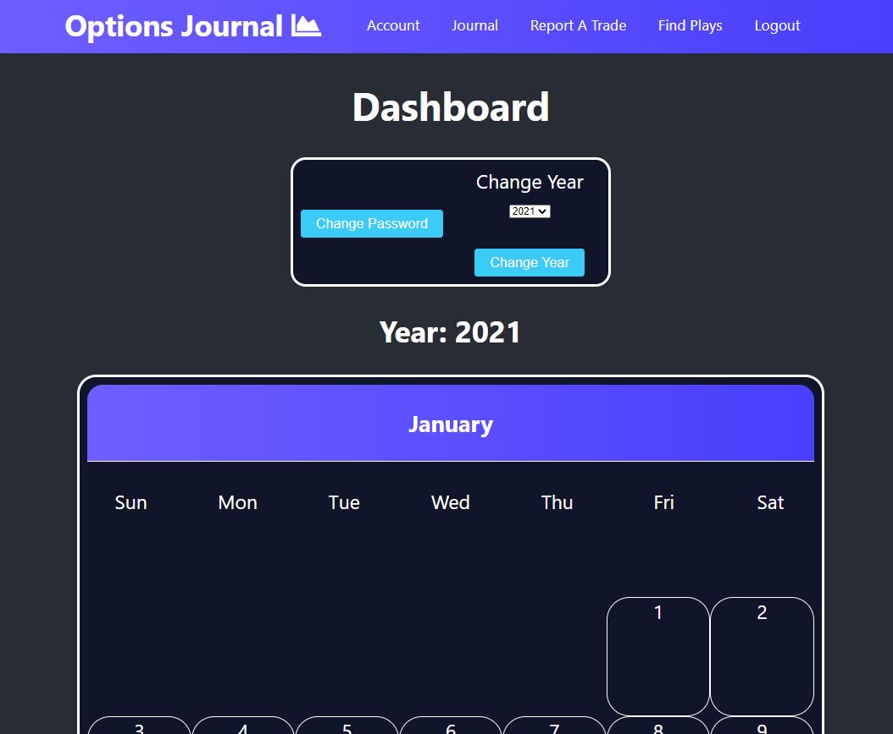
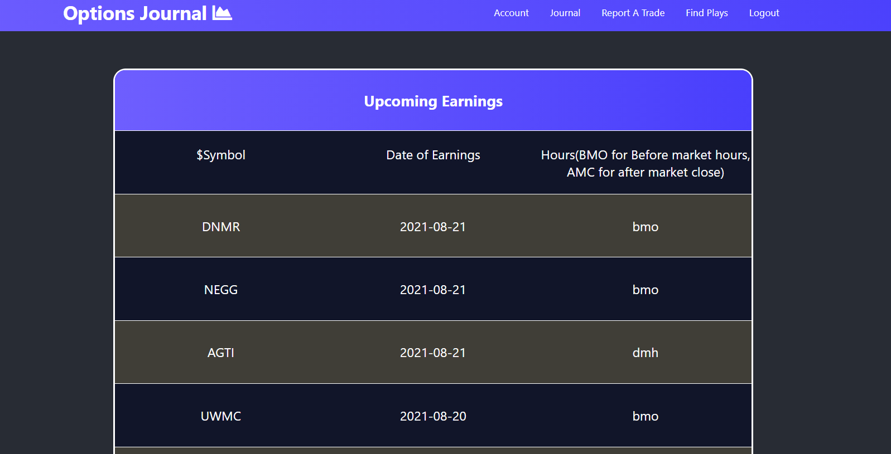
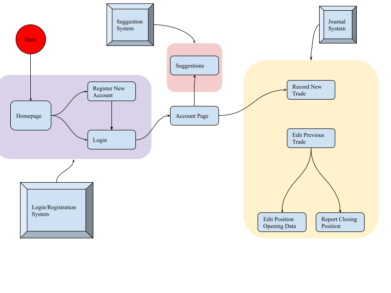

# OptionsJournal
Options Journal is a service where derivatives traders can go to record their trades. Keeping track of how a trader does over a given period of time is paramount. With this tool you could see how certain strategies you have employed played out and with that information, make better decisions. 

## Technologies and Concepts Used 
* Node.js
* React
* MongoDB
* Express JS
* RESTful APIs
* Heroku
* Dynamic Frontend
* Web tokens

## How it works

### Getting Started
To get started, all you need to do is create an account.

### Recording and Editing a Trade

#### Recording
Once logged in, in order to record a new or previous trade, all you need to do is go to the journal section and press add at the top of your journal. You can alternatively click on 'Report a Trade' on the navbar. You will be sent to a page with a form where you can fill in information about the trade. Once you've completed the form, the journal will be updated with the new trade and the calendar on the dashboard will populate that trade to the corresponding date. Clicking on the calendar date will show you more details about the trade that expires on the corresponding date. 

#### Editing
To edit a trade you just needs to go the the Journal page and hit the edit button on the right most column, doing this will bring you back to the form where you filled
out the trade originally. You can fill in any missing items or change them as you please.

### Suggestions Page
If you click the link to the suggestions page (which is found on the navbar as 'find plays') you will be brought to a page that will load a list of all upcoming earnings. These dates have been provided by a third-party API call.

## Screenshots
### Dashboard

### Suggestions


## Code Examples
### Handling Invalid Web Tokens
When a user logs in, a unique web token is stored in the session. The token, in conjunction with a secret key, acts as a way to validate a user. This new conjoined key is then
tested against the hashed password on the database to ensure that the user is really who they claim to be. The following code snippet is a function that gets called by many of my APIs to ensure the user has a valid signature. If the signature is invalid then they are bounced to the login screen and a toast is fired claiming that the signature is invalid.

``` javascript
// if no such user exists with a given token, then an error is thrown and validateUser returns false.
function validateUser(){
	token = ls.get('token')
	try{
		const username = jwt.verify(token, SECRET).username
		return true
	}
	catch(error){
		return false
	}
}
```

## Process Diagram
Below is a simple process diagram that explains the process flow of the website on a basic level.




## Closing Thoughts
I found this project to be a very great learning experience. I learned a lot about developing simple yet effective APIs with Node.js, dynamic and visually pleasing user interfaces with React, creating schemas and managing data with MongoDB, and routing with Express.js. I will use the knowledge I gained to engineer better websites, and maybe this time use TypeScript to make sure my code is both safe and more easily maintainable. Overall, I'm happy with this project, and can't wait to see where I go next. 
